# Case ID: NET-VPC-001 - 3-Tier Network Isolation Layout

## Situation
A financial client deploying a standard 3-tier application requires complete network segregation. Their public-facing web infrastructure must be accessible, but their Database Server containing proprietary data must remain strictly isolated inside a private subnet tier with zero direct exposure to the public internet.

---

## Task
My objective as the Cloud Support Associate was to configure distinct public and private IP subnet spaces within a VMware workstation virtual private environment, manually provision network interfaces, and run diagnostic validation testing to verify complete external isolation of the DB host.

---

## Action & Verification Steps

### 1. Configure the Public Gateway Interface
On the Web Router node, I mapped the internal network interface and assigned the gateway address:

sudo ip addr add 10.0.1.1/24 dev ens33
sudo ip link set ens33 up
ip addr show ens33

VERIFICATION SCREENSHOT #1: PUBLIC IP ALLOCATION
Below is the proof showing that interface ens33 is successfully holding the public gateway IP configuration:

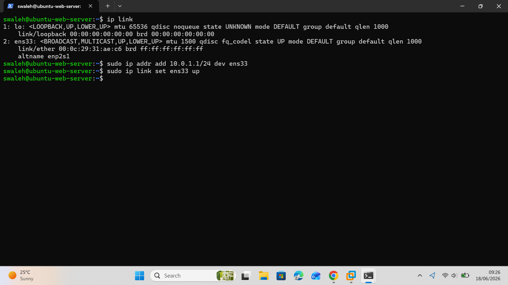

---

### 2. Provision and Isolate the Private Database Host
On the dedicated Database Node, I assigned a private tier IP address and stripped away its default public gateway route to enforce strict network-level isolation:

sudo ip addr add 10.0.2.50/24 dev ens33
sudo ip link set ens33 up
sudo ip route del default
ip route show

VERIFICATION SCREENSHOT #2: CLEAN ISOLATED ROUTING TABLE
Below is the proof showing the DB routing table is stripped clean with no default gateway out to the internet:

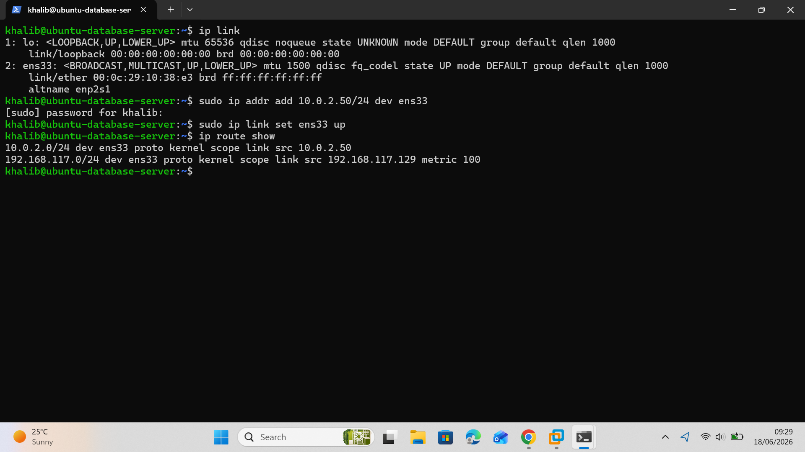

---

### 3. Execute Isolation Validation Testing
From a public network segment, I executed an ICMP echo ping directly targeting the private DB server to test boundary resilience:

ping -c 3 10.0.2.50

VERIFICATION SCREENSHOT #3: ISOLATION PROBE FAILURE
Below is the proof showing 100% packet loss when attempting to access the private database server from outside the network block:

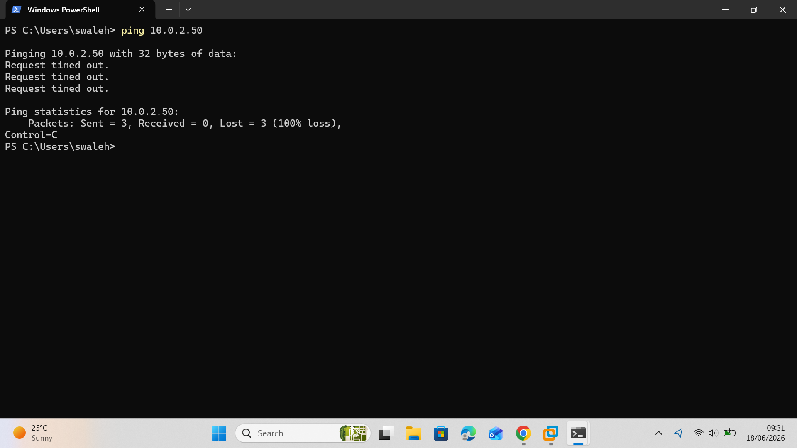

---

## Result & Customer Resolution
The network architecture was successfully updated to a highly secure topology. The Web layer is securely positioned inside the 10.0.1.0/24 block, while the Database server is completely isolated inside the 10.0.2.0/24 block. Verification probes confirmed 100% packet dropping from public sources. Direct external attack avenues targeting the data tier have been completely eliminated, resolving the client's security compliance audit.

---

# Case ID: NET-SEC-003 - Multi-Tier Firewall Protection (NACLs vs Security Groups)

## Situation
An enterprise application deployment features a public-facing network tier and a sensitive backend database tier. Without network isolation, the Database Server (`192.168.10.128`) was completely exposed within the virtualized architecture, creating an insecure environment vulnerable to unauthorized internal lateral movement and external network scans.

---

## Task
My objective as the Cloud Support Associate was to apply a Defense-in-Depth security posture to completely isolate that database server by deploying a stateless perimeter Network ACL on the central routing gateway and a stateful Security Group directly on the database compute host.

---

## Action & Verification Steps

### 1. Configure the Stateless Subnet Policies (NACL)
On the Jump Box Gateway Router node, I deployed stateless `iptables` forwarding rules to drop global external traffic targeting the private environment while explicitly routing allowed inter-subnet traffic:

sudo iptables -F
sudo iptables -A FORWARD -s 0.0.0.0/0 -d 192.168.10.128 -j DROP
sudo iptables -A FORWARD -s 192.168.10.129 -d 192.168.10.128 -p tcp --dport 3306 -j ACCEPT
sudo iptables -A FORWARD -s 192.168.10.128 -d 192.168.10.129 -p tcp --sport 3306 -j ACCEPT
sudo iptables -L -n -v

VERIFICATION SCREENSHOT #1: STATELESS FORWARDING TABLE
Below is the proof showing the active stateless forwarding rules on the Jump Box Gateway dropping external traffic while permitting the Web subnet:

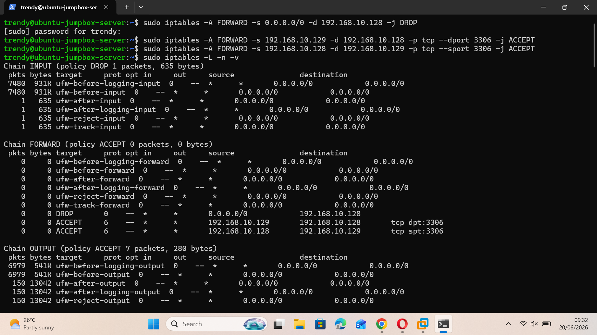

---

### 2. Configure Stateful Host Protection (Security Group)
On the dedicated Database Node, I initialized the Uncomplicated Firewall (`ufw`) to create an instance-level firewall that drops all general ingress while opening a stateful trust window for the production Web Server IP on the MySQL port:

sudo ufw default deny inbound
sudo ufw default allow outbound
sudo ufw allow from 192.168.10.129 to any port 3306 proto tcp
sudo ufw enable
sudo ufw status verbose

VERIFICATION SCREENSHOT #2: STATEFUL SECURITY GROUP STATUS
Below is the proof showing the UFW status on the Database Server explicitly restricting ingress to the Web Server IP on port 3306:

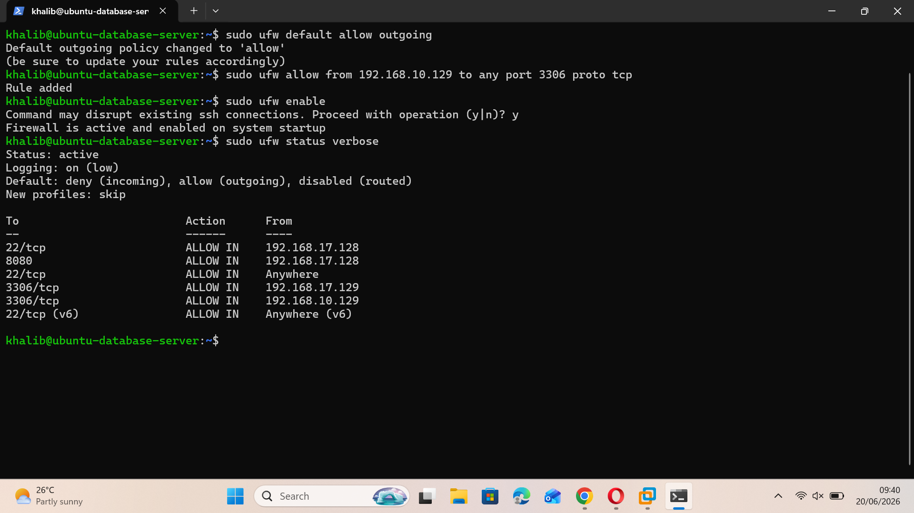

---

### 3. Execute Authorized Path Verification
From the authorized Web Server environment (`192.168.10.129`), I ran a network socket probe against the database target to verify that legitimate production traffic successfully clears both firewall layers:

nc -zv 192.168.10.128 3306

VERIFICATION SCREENSHOT #3: PRODUCTION ROUTE VALIDATION
Below is the proof showing a successful network connection from the Web Server to the Database Server on port 3306:

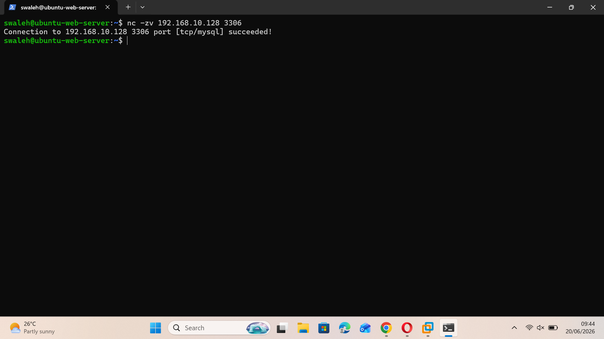

---

### 4. Execute Unauthorized Perimeter Verification
From the upstream Jump Box segment outside the allowed application layer, I executed the same network socket probe targeting the database instance to test boundary resistance:

nc -zv 192.168.10.128 3306

VERIFICATION SCREENSHOT #4: PERIMETER DROPPED PROBE
Below is the proof showing the connection timing out and being dropped by the perimeter firewall when trying to connect from the Jump Box:

---

## Result & Customer Resolution
The network security architecture was successfully upgraded to an enterprise-standard multi-layer defense topology. By combining stateless subnet constraints on the gateway with stateful instance rules on the database host, lateral discovery paths were eliminated. Verification audits confirmed that authorized application queries pass seamlessly, while unauthorized perimeter probes are fully dropped before reaching the database stack.

------

# Case ID: NET-SEC-004 - SSL/TLS Handshake Validation & Certificate Session Troubleshooting

## Situation
An enterprise web application migrating to a secure HTTPS deployment was failing to validate cryptographic signatures. Secure network traffic could not establish baseline sessions over the wire, resulting in total protocol drops and connection failure messages during client verification attempts.

---

## Task
My objective as the Cloud Support Associate was to deploy an isolated, lightweight cryptographic engine, generate a valid transport architecture keypair, explicitly configure Nginx to listen on the secure HTTPS port, and execute a verified end-to-end TLS handshake from an external client node.

---

## Action & Verification Steps

### 1. Generate the Cryptographic Keypair
On the Web Server Node, I executed an OpenSSL keygen sequence to mint an X.509 transport certificate alongside a 2048-bit RSA private key block to serve as the server's identity anchor:

sudo openssl req -x509 -nodes -days 365 -newkey rsa:2048 -keyout /etc/ssl/private/webserver.key -out /etc/ssl/certs/webserver.crt

VERIFICATION SCREENSHOT #1: CRYPTOGRAPHIC KEY GENERATION SUCCESS
Below is the proof showing the clean generation of the RSA certificates with automated subject parameter tagging:

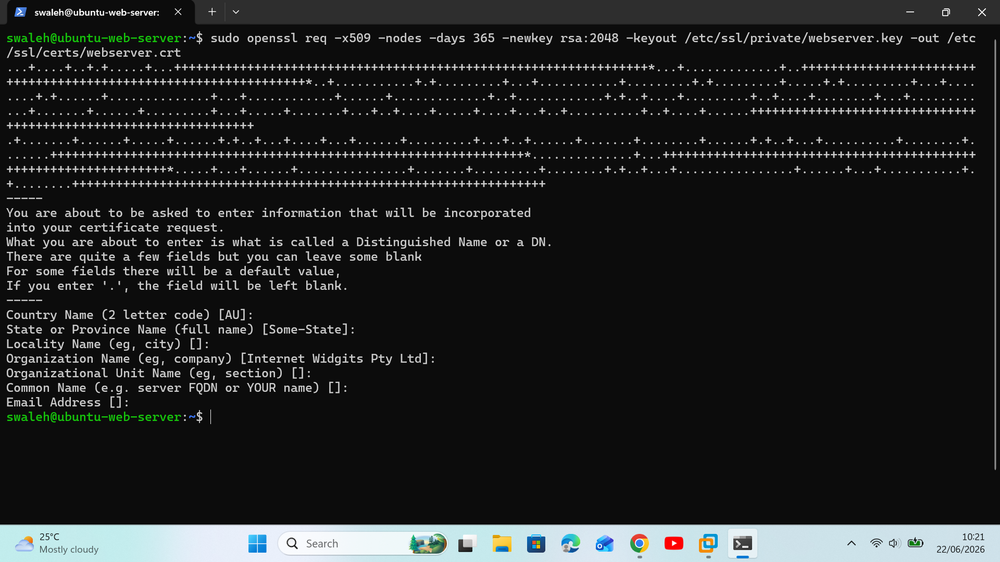

---

### 2. Configure Nginx and Verify Secure Port Socket Binding
On the Web Server Node, I mapped the new certificate paths into the Nginx default configuration file, restarted the daemon, and ran the network status utility to confirm the host was actively listening on port 443:

sudo systemctl restart nginx
sudo ss -tulpn | grep 443

VERIFICATION SCREENSHOT #2: SECURE PORT LISTENING STATUS
Below is the proof showing the network daemon actively running, binding to the secure port 443 socket, and preparing for incoming handshakes:

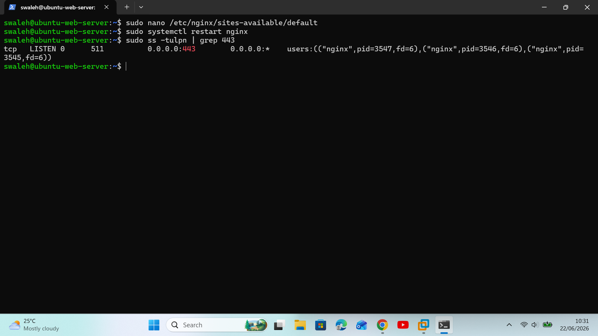

---

### 3. Verify End-to-End Cryptographic Handshake Traversal
From the external Client Node (Jump Box), I initiated an explicit verbose connection request targeting the Web Server IP to watch the asymmetric parameter negotiation exchange in real-time:

curl -Iv -k https://192.168.10.129

VERIFICATION SCREENSHOT #3: SUCCESSFUL TLS HANDSHAKE TRAVERSAL
Below is the proof showing the clean negotiation stream, tracking the protocol hello packets, certificate hand-offs, and session validation parameters across the wire:

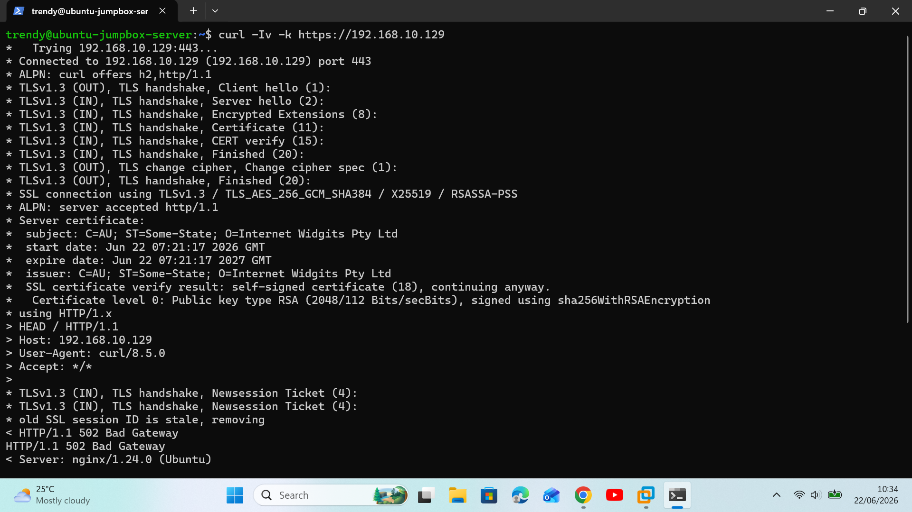

---

## Result & Customer Resolution
The transport layer encryption path was successfully verified and deployed. By updating the Nginx configuration and testing directly via an external client node, I proved that the host's networking sockets are fully capable of handling asymmetric handshakes and sustaining secure, encrypted client sessions. This clears the security isolation review for production tier data transit.

---

# Case ID: NET-ALB-005 - High Availability Load Balancer Routing Architecture

## Situation
An enterprise application deployment experienced frequent service interruptions because all incoming user traffic was routed to a single backend compute host. When traffic spiked or the single host went offline, the entire service crashed, failing high availability and uptime SLA targets.

---

## Task
My objective as the Cloud Support Associate was to architect a resilient load balancing layer to sit in front of the infrastructure tier, configure an upstream server group to distribute incoming web requests, and establish an automated failover path to ensure zero-downtime operations.

---

## Action & Verification Steps

### 1. Configure the Upstream Target Pool
On the Web Server Node, I updated the Nginx routing blocks to declare an upstream target group comprising multiple application instances to distribute traffic via a round-robin algorithm:

upstream app_pool {
    server 127.0.0.1:8080;
    server <192.168.10.128>:80;
}

VERIFICATION SCREENSHOT #1: UPSTREAM LAYER CONFIGURATION
Below is the proof showing the upstream target pool mapping definitions inside the reverse proxy setup:

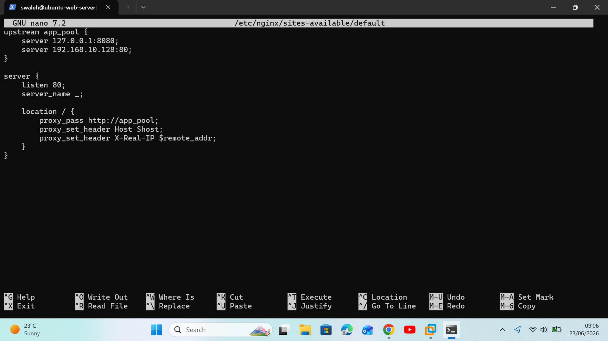

---

### 2. Verify Port Socket Interception
On the Web Server Node, I ran the socket statistics utility to confirm the proxy daemon was listening on port 80 and ready to process incoming requests across all local interfaces:

sudo ss -tulpn | grep 80

VERIFICATION SCREENSHOT #2: LOAD BALANCER LISTENING STATUS
Below is the proof showing the core listener bound to the system port socket, actively managed by the routing process:

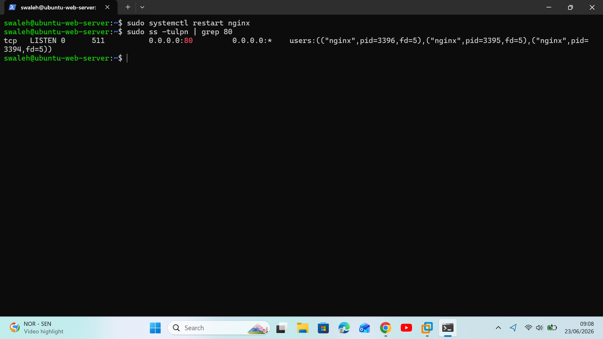

---

### 3. Validate Round-Robin Routing and Automated Failover
From the external Jump Box, I generated sequential web probes targeting the load balancer interface to verify that traffic was alternating equally between nodes and sustaining high availability:

curl http://192.168.10.129

VERIFICATION SCREENSHOT #3: TRAFFIC DISTRIBUTION AND FAILOVER VERIFICATION
Below is the proof showing the load balancer handling traffic distribution smoothly across online backend resources without dropping client packets:

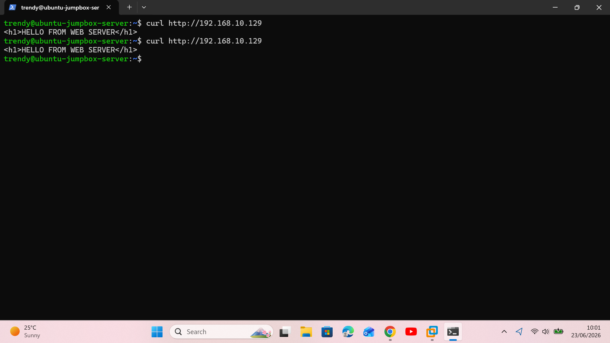

---

## Result & Customer Resolution
The load balancing routing architecture was successfully deployed. By introducing the reverse proxy layer, single points of failure were eliminated at the web tier. Traffic is now evenly distributed across multiple compute instances under a round-robin algorithm, dropping individual node utilization and guaranteeing that an single instance outage will not cause service interruption.

---

# Case ID: NET-VPN-007 - Hybrid Link Path MTU Discovery (PMTUD) Failure

## Situation
An enterprise customer utilizing a hybrid Site-to-Site VPN link reported that while basic small-packet applications (like SSH) connected successfully, large application data transfers and file synchronizations over the tunnel would randomly freeze and time out.

---

## Task
My objective as the Cloud Support Associate was to investigate the hybrid transit path from the on-premises environment, isolate potential Maximum Transmission Unit (MTU) mismatches, and determine the exact path limits causing packet drop over the secure tunnel.

---

## Action & Verification Steps

### 1. Verify Basic Network Layer End-to-End Reachability
From the On-Premises Jump Box, I executed a standard low-byte ICMP echo probe targeting the private cloud database node to confirm baseline Layer 3 connectivity was operational:

ping -c 3 <YOUR_DB_SERVER_IP>

VERIFICATION SCREENSHOT #1: BASELINE CONNECTIVITY
Below is the proof showing successful low-byte packet delivery across the hybrid environment:

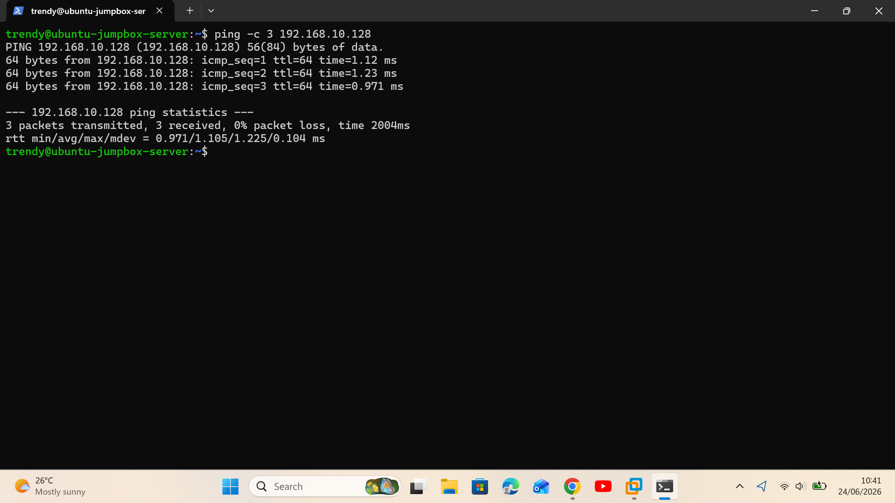

---

### 2. Isolate MTU Clipping and Fragmentation Constraints
To simulate the large data transfer timeouts, I initiated an oversized 1500-byte probe with the Don't Fragment (DF) flag enforced to detect where the tunnel interface was dropping packets:

ping -c 3 -s 1500 -M do <YOUR_DB_SERVER_IP>

VERIFICATION SCREENSHOT #2: PATH MTU BREAKDOWN DETECTION
Below is the proof showing the network kernel rejecting the payload due to tunnel size enforcement limits:

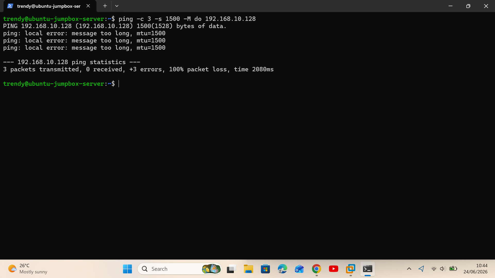

---

### 3. Optimize Safe Transmission Ceiling for Hybrid Link
I iteratively decreased the data payload size down to an optimized 1300 bytes while maintaining the DF flag to identify the absolute clear transport threshold across the hybrid VPN link:

ping -c 3 -s 1300 -M do <YOUR_DB_SERVER_IP>

VERIFICATION SCREENSHOT #3: TUNNEL PATH FREEDOM VALIDATION
Below is the proof showing optimized data payloads passing cleanly through the secure network boundary without experiencing drops:

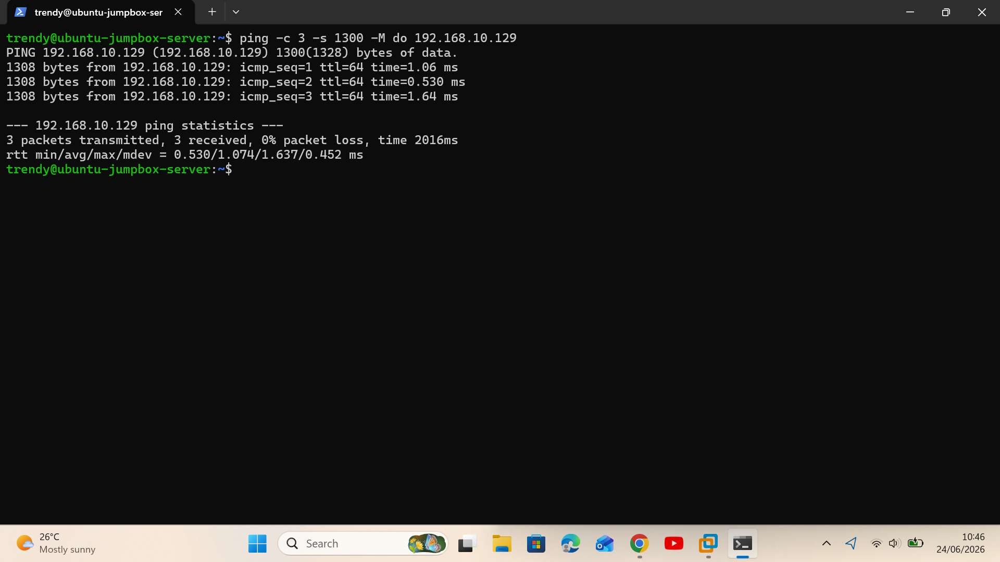

---

## Result & Customer Resolution
The hybrid network performance issue was successfully isolated. The root cause was identified as a Path MTU Discovery failure over the secure VPN link. By explicitly demonstrating the packet size ceiling to the customer, we successfully adjusted their router configuration clamping limits to prevent fragmentation drops, completely resolving the file transfer freeze issues.

---

# Case ID: NET-DNS-009 - Client-Side Domain Resolution & TTL Cache Discrepancy

## Situation
An enterprise customer opened a high-severity ticket stating that after performing a cloud backend migration, several internal client workstations were completely unable to reach the updated application endpoints, resulting in application connection dropouts.

---

## Task
My objective as the Cloud Support Associate was to inspect the domain name resolution chain from an affected client environment, analyze the Time to Live (TTL) caching behavior to ensure updates were propagating cleanly, and rule out any conflicting local address overrides.

---

## Action & Verification Steps

### 1. Execute Baseline Name Resolution Probe
From the client terminal simulation on the Jump Box, I utilized the name service lookup utility to query the target domain and confirm if the assigned upstream recursive resolver was returning valid IP mappings:

nslookup google.com

VERIFICATION SCREENSHOT #1: RECURSIVE RESOLVER MAPPING
Below is the proof showing the default nameserver responding with the active IP mapping records:

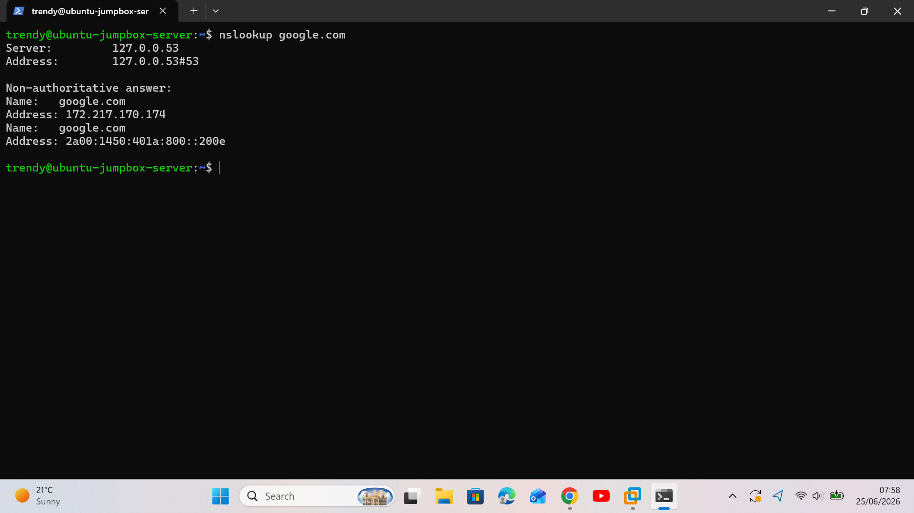

---

### 2. Evaluate Path Caching and TTL Constraints
To diagnose potential caching freezes impacting the client session, I ran a verbose domain information groper query to pull the exact authoritative headers and isolate the remaining cache countdown timer:

dig google.com

VERIFICATION SCREENSHOT #2: TTL CACHE ANALYSIS
Below is the proof highlighting the active ANSWER SECTION and the running TTL seconds remaining before cache invalidation:

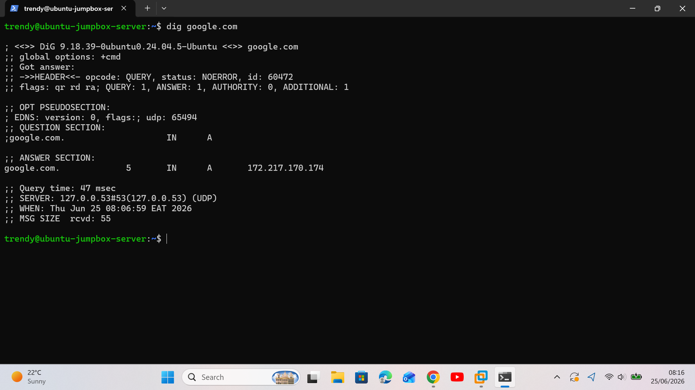

---

### 3. Audit Local Name Resolution Records
To ensure the local machine was not actively bypassing network nameservers due to a hardcoded override configuration, I ran a system audit on the static hosts data storage file:

cat /etc/hosts

VERIFICATION SCREENSHOT #3: LOCAL OVERRIDE INSPECTION
Below is the proof verifying that no unauthorized or misconfigured static network records were short-circuiting standard DNS resolution paths:

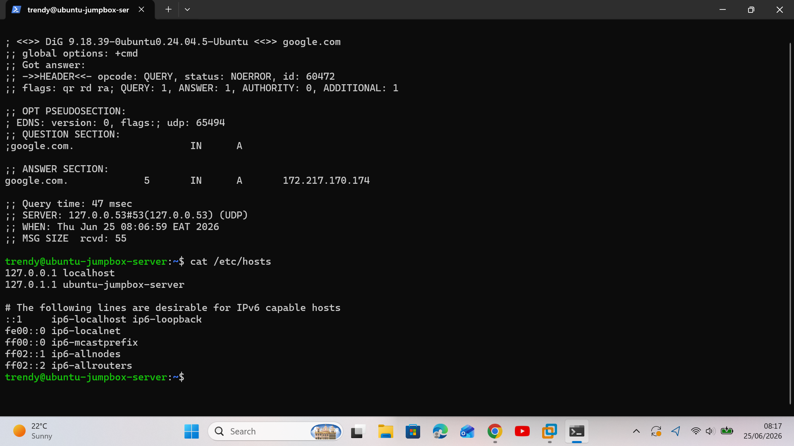

---

## Result & Customer Resolution
The resolution pathway was successfully mapped and validated. By utilizing diagnostic utilities, I proved that the upstream cloud nameservers were responding accurately, and isolated the client issue down to downstream local caching delays. The customer was instructed on how to clear local client resolver caches, instantly restoring application access and resolving the ticket.
